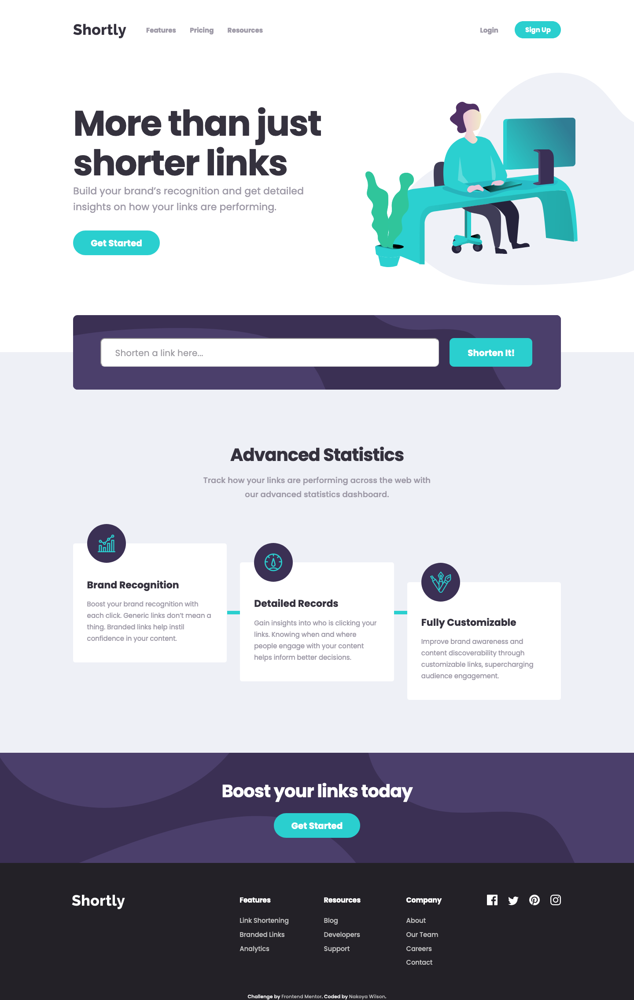

# Frontend Mentor - Shortly URL shortening API Challenge solution

This is a solution to the [Shortly URL shortening API Challenge challenge on Frontend Mentor](https://www.frontendmentor.io/challenges/url-shortening-api-landing-page-2ce3ob-G). Frontend Mentor challenges help you improve your coding skills by building realistic projects.

## Table of contents

- [Overview](#overview)
  - [The challenge](#the-challenge)
  - [Screenshot](#screenshot)
  - [Links](#links)
- [My process](#my-process)
  - [Built with](#built-with)
- [Author](#author)

**Note: Delete this note and update the table of contents based on what sections you keep.**

## Overview

### The challenge

Users should be able to:

- View the optimal layout for the site depending on their device's screen size
- Shorten any valid URL
- See a list of their shortened links, even after refreshing the browser
- Copy the shortened link to their clipboard in a single click
- Receive an error message when the `form` is submitted if:
  - The `input` field is empty

### Screenshot

### Links

- Solution URL: [https://www.frontendmentor.io/solutions/mobile-first-url-shortening-api-landing-page-fbEHagIBg](https://www.frontendmentor.io/solutions/mobile-first-url-shortening-api-landing-page-fbEHagIBg)
- Live Site URL: [https://nakoyawilson-url-shortening-api.netlify.app/](https://nakoyawilson-url-shortening-api.netlify.app/)

## My process

### Built with

- HTML
- CSS
- Mobile-first workflow
- Figma File
- [React](https://reactjs.org/)
- [Axios](https://axios-http.com/)
- [react-uuid](https://www.npmjs.com/package/react-uuid)
- [react-copy-to-clipboard](https://www.npmjs.com/package/react-copy-to-clipboard)

## Author

- Website - [Nakoya Wilson](https://nakoyawilson.netlify.app/)
- Frontend Mentor - [@nakoyawilson](https://www.frontendmentor.io/profile/nakoyawilson)
- Twitter - [@nakoyawilson](https://twitter.com/nakoyawilson)
- LinkedIn - [@nakoyawilson](https://www.linkedin.com/in/nakoyawilson/)
